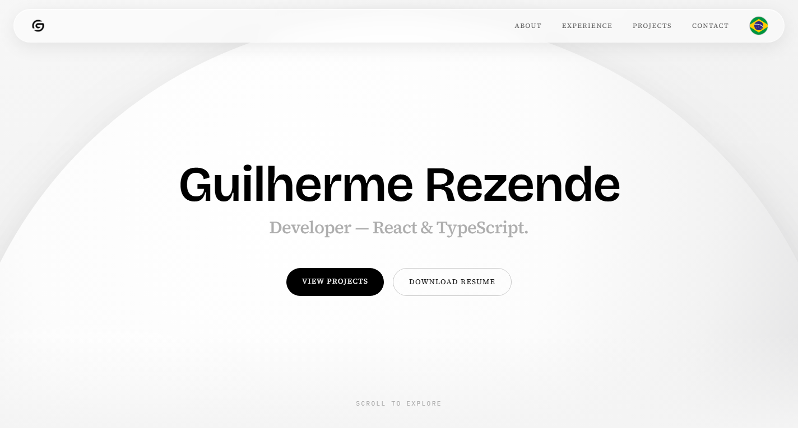

# Guilherme Rezende — Portfolio

[](https://github.com/guilhermerezende10/Portfolio/actions/workflows/ci.yml)

Personal portfolio of Guilherme Rezende — a fast, bilingual, scroll-driven single-page site for a software developer (React / TypeScript).

**Live:** [www.guilhermerezende.dev.br](https://www.guilhermerezende.dev.br)



## Tech stack

- **React 18** + **TypeScript** (strict mode, `tsc -b`)
- **Tailwind CSS v4** via the `@tailwindcss/vite` plugin
- **Vite 5** for dev server and production build
- **ESLint 9** (flat config) with the TypeScript and React Hooks plugins

## Highlights

- **Bilingual (PT / EN) i18n** — language is auto-detected from the browser, toggleable in the nav, and persisted in `localStorage`. The tab title and meta description update with the active language.
- **Scroll-driven animation system** — a single `useSiteAnimations` hook wires up every effect (hero entrance, reveal-on-scroll, parallax, and the education timeline fill) declaratively through `data-*` attributes on the markup.
- **Reduced-motion support** — respects `prefers-reduced-motion`: the animation runtime bails out and CSS reveals all content statically, so nothing is hidden for users who opt out of motion.

## Running locally

Requires **Node 18+**.

```bash
npm install
npm run dev      # start the Vite dev server
```

Then open the URL Vite prints (default http://localhost:5173).

To create and preview a production build:

```bash
npm run build    # type-check (tsc -b) and bundle with Vite
npm run preview  # serve the production build locally
```

## Scripts

| Script            | Description                                     |
| ----------------- | ----------------------------------------------- |
| `npm run dev`     | Start the Vite dev server.                      |
| `npm run build`   | Type-check and build for production.            |
| `npm run lint`    | Run ESLint over the project.                    |
| `npm run preview` | Preview the production build locally.           |
